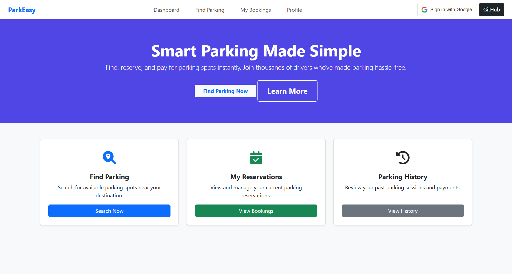

# 🚗 Smart Parking - ParkEasy

A simple and modern parking management front-end built with HTML, CSS, Bootstrap, and Google OAuth.

---

## 🌟 Features

- 🔍 Find parking spots quickly
- 📅 View and manage reservations
- 📜 See parking history (empty message if none)
- 🔐 Google OAuth for authentication
- 🖱️ Animations and pointer effects
- 📱 Responsive UI with Bootstrap 5

---

## 🧱 Tech Stack

- HTML5
- CSS3 + Bootstrap 5
- JavaScript (vanilla)
- Google OAuth (Client-side only)
- Font Awesome icons

---

## 📂 Project Structure

